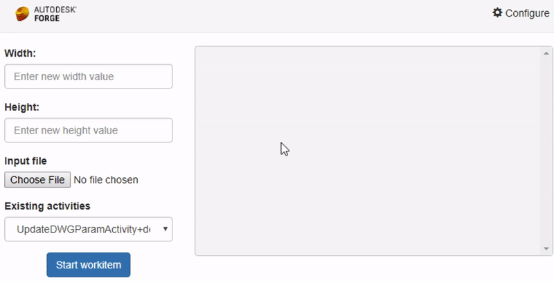

# learn.forge.designautomation - ASP.NET Core


[](http://opensource.org/licenses/MIT)

[](http://developer.autodesk.com/)
[](http://developer.autodesk.com/)
[](http://developer.autodesk.com/)


# Description

Webapp interface that uses Design Automation to update the `width` and `height` param of DWG Dynamic Block (using AutoCAD), RVT Window Family instance (using Revit), IPT Part parameters (using Inventor) and 3DS ... (using 3dsMax). Also includes a `Clear Account` (remove all AppBundles and Activities) and `Define new Activity` based on the sample code. Uses ASP.NET Core SignalR to update the interface.

See other projects for bundles.

## Thumbnail



# Setup

## Prerequisites

1. **Forge Account**: Learn how to create a Forge Account, activate subscription and create an app at [this tutorial](http://learnforge.autodesk.io/#/account/). 
2. **Visual Studio**: Either Community (Windows) or Code (Windows, MacOS).
3. **.NET Core** basic knowledge with C#
4. **ngrok**: Routing tool, [download here](https://ngrok.com/). 

## Running locally

Clone this project or download it. It's recommended to install [GitHub desktop](https://desktop.github.com/). To clone it via command line, use the following (**Terminal** on MacOSX/Linux, **Git Shell** on Windows):

    git clone https://github.com/autodesk-forge/learn.forge.designautomation
    
**ngrok**

When a `Workitem` completes, **Design Automation** can notify our application. As the app is running locally (i.e. `localhost`), it's not reacheable from the internet. `ngrok` tool creates a temporary address that channels notifications to our `localhost` address.

After [download ngrok](https://ngrok.com/), run `ngrok http 3000 -host-header="localhost:3000"`, then copy the `http` address into the `FORGE_WEBHOOK_CALLBACK_HOST` environment variable (see next). For this sample, do not use the `https` address.

 

**Visual Studio** (Windows):

Right-click on the project, then go to **Debug**. Adjust the settings as shown below. 

 

**Visual Sutdio Code** (Windows, MacOS):

Open the `webapp` folder (only), at the bottom-right, select **Yes** and **Restore**. This restores the packages (e.g. Autodesk.Forge) and creates the launch.json file. See *Tips & Tricks* for .NET Core on MacOS.


At the `.vscode\launch.json`, find the env vars and add your Forge Client ID, Secret and callback URL. Also define the `ASPNETCORE_URLS` variable. The end result should be as shown below:

```json
"env": {
    "ASPNETCORE_ENVIRONMENT": "Development",
    "ASPNETCORE_URLS" : "http://localhost:3000",
    "FORGE_CLIENT_ID": "your id here",
    "FORGE_CLIENT_SECRET": "your secret here",
    "FORGE_WEBHOOK_CALLBACK_HOST": "http://1234.ngrok.io",
},
```

**How to use this sample**

Open `http://localhost:3000` to start the app, if first time, click on `Define Activity`, enter new `width` & `height` values, select the input file (use from **sample files** folder), select the `Activity` and, finally, `Start workitem`. 

# Further Reading

Documentation:

- [Design Automation v3](https://forge.autodesk.com/en/docs/design-automation/v3/developers_guide/overview/)
- [Data Management](https://forge.autodesk.com/en/docs/data/v2/reference/http/) used to store input and output files.

Other APIs:

- [.NET Core SignalR](https://docs.microsoft.com/en-us/aspnet/core/signalr/introduction?view=aspnetcore-2.2)

### Tips & Tricks

This sample uses .NET Core and works fine on both Windows and MacOS, see [this tutorial for MacOS](https://github.com/augustogoncalves/dotnetcoreheroku). You still need Windows debug the AppBundle plugins.

### Troubleshooting

1. **error setting certificate verify locations** error: may happen on Windows, use the following: `git config --global http.sslverify "false"`

## License

This sample is licensed under the terms of the [MIT License](http://opensource.org/licenses/MIT). Please see the [LICENSE](LICENSE) file for full details.

## Written by

Augusto Goncalves [@augustomaia](https://twitter.com/augustomaia), [Forge Partner Development](http://forge.autodesk.com)